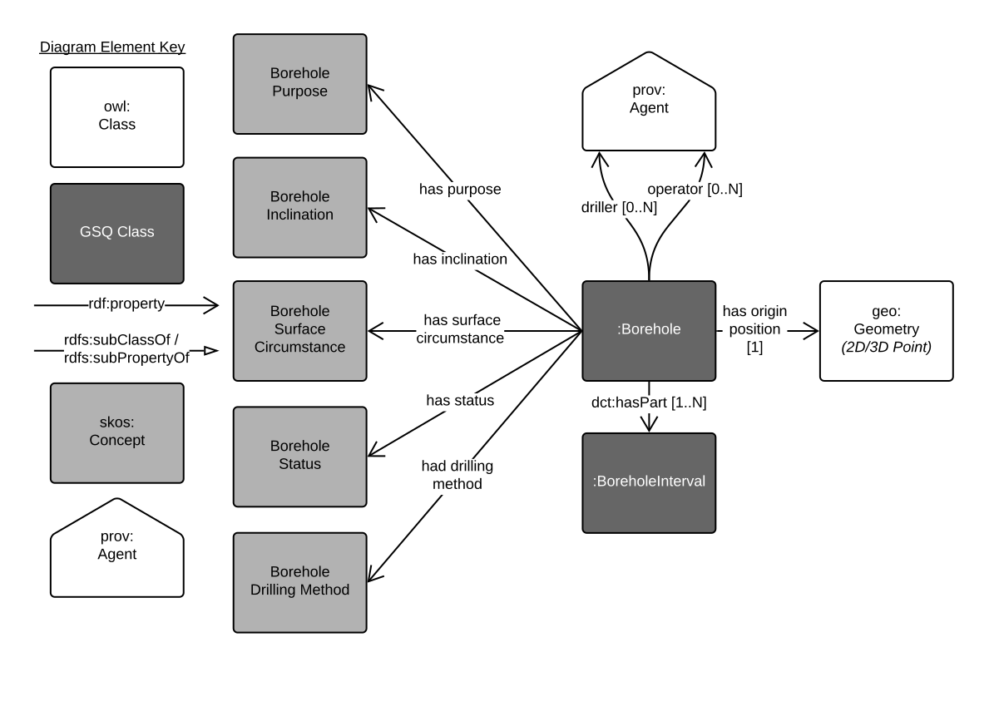
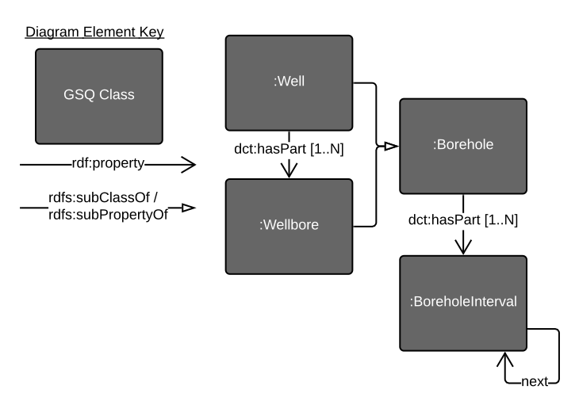
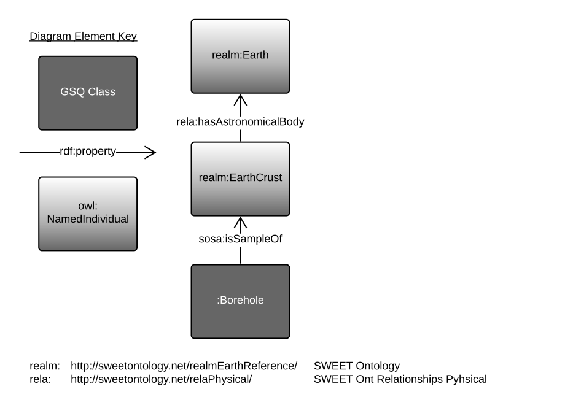
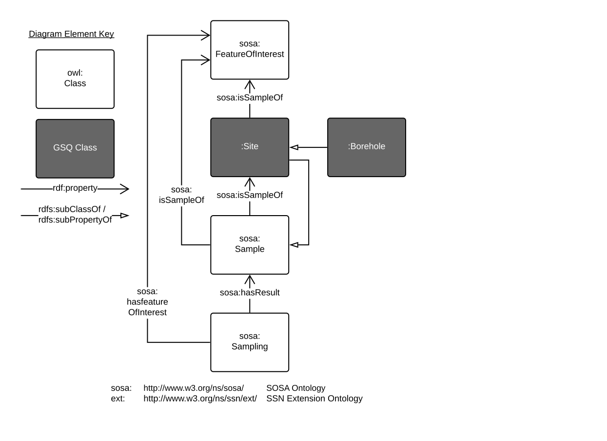

# GSQ Borehole Profile
A model of a geoscience *borehole* which may also be known as a *drillbore*, *well*, *wellbore*. This model includes specialised variants for all sorts.

This model is online at it's namespace location:

* **http://linked.data.gov.au/def/borehole**

  

**Fig. 1**: Main properties of the *Borehole* class.

This is the [Geological Survey of Queensland (GSQ)](https://www.business.qld.gov.au/industries/mining-energy-water/resources/geoscience-information/gsq)'s' own profile of multiple specifications for boreholes and sampling features. The specific specifications that this model profiles are:

* [GeoSPARQL](https://www.opengeospatial.org/standards/geosparql) - an OGC standard for representing real-world features and their geometries. Used for many spatial objects
* [GeoSciML](https://www.opengeospatial.org/standards/geosciml) - an [Open Geospatial Consortium](https://www.opengeospatial.org/) (OGC) standard for geoscience data representation that includes a borehole model
* [Observations & Measurements](https://www.iso.org/standard/32574.html) - an [International Organization for Standardisation](https://www.iso.org) (ISO) model for real-world observations, measurement and features of interest
  * O&M is profiled by this Profile's use of SOSA, see next
* [Sensor, Observation, Sample, and Actuator (SOSA)](https://www.w3.org/TR/vocab-ssn/) - part of the [World Wide Web Consortium](https://www.w3.org/)'s Semantic Sensor Network ontology about sites, sampling, observations & sensors

This profile is designed to meet the needs of the [Geological Survey of Queensland]() (GSQ) and to both interoperate with other information models and profiles in use by them (such as the [GSQ Samples Profile](https://github.com/CSIRO-enviro-informatics/gsq-sample-profile) and the [GSQ Dataset Profile](https://github.com/CSIRO-enviro-informatics/gsq-dataset-profile)) and also with national (Australia) and international geoscience information models and systems.

## Profile perspectives 

Here are a serices of perspectives (views) of this profile.

 
**Fig. 2**: This profile's Borehole Classes. *Well* & *Wellore* are specialised types of *Borehole* with a *Well* containing multiple *Wellbores*. A *Borehole* is composed of one or more *BoreholeIntervals*. *BoreholeIntervals* may be in sequence with other *BoreholeIntervals* (Interval X, next, Intervay Y).

   
**Fig. 3**: Alignment with GeoSPARQL: `Borehole` as a GeoSPARQL `Feature`  

 
**Fig. 4**: Alignment with [SWEET](http://www.sweetontology.org/): `Borehole` in relation to SWEET ontology individuals  

 
**Fig. 5**: Alignment with SOSA: `Borehole` in relation SOSA objects (for sample relations). Also included is GSQ's eneral `Site` class  

## Profile Resources
This profile is presented as a series of files that perform different roles:

* [Guidance document](Guidance.pdf) - a written document explaining how to use this profile
* [model](model/) - the *model* folder contains the model specification itself. This is given as both images and also as a formal [RDF](https://www.w3.org/RDF/) model file (ontology).
* [profile.html](profile.html) - normative model documentation, online as a web page for human reading, at **http://linked.data.gov.au/def/borehole**
* [profile.ttl](profile.ttl) - the profile declaration. A description of all of the items in this profile (the formal model, validating resources, documentation etc.) according to the W3C's [Profiles Vocabulary](https://www.w3.org/TR/dx-prof/) which describes how all the parts related to one another, the roles they play (to give *guidance* for use, to *validate* data etc.) and how this profile *profiles* the various standards listed above.
* [full-constraints.ttl](full-constraints.ttl) - a [SHACL](https://www.w3.org/TR/shacl/) constraints language *Shapes graph* used to validate instances of `Borehole`s expressed in RDF
* [ckan-schema.json](ckan-schema.json) - a form schema for the [CKAN dataset catalogue tool](https://ckan.org) to create a data entry form for `Borehole`s

## License
The content of this repository is licensed for use with the [Creative Commons 4.0 License](https://creativecommons.org/licenses/by/4.0/). See the [license deed](LICENSE) for details.

## Contacts
*owner*:  
**Geological Survey of Queensland**  
1 William St, Brisbane, Queensland, Australia  

*author*:  
**Nicholas Car**  
*Data Systems Architect*  
SURROUND Austrlia Pty Ltd  
*(formerly of CSIRO)*   
<nicholas.car@surroundaustralia.com>  
https://surroundaustralia.com
