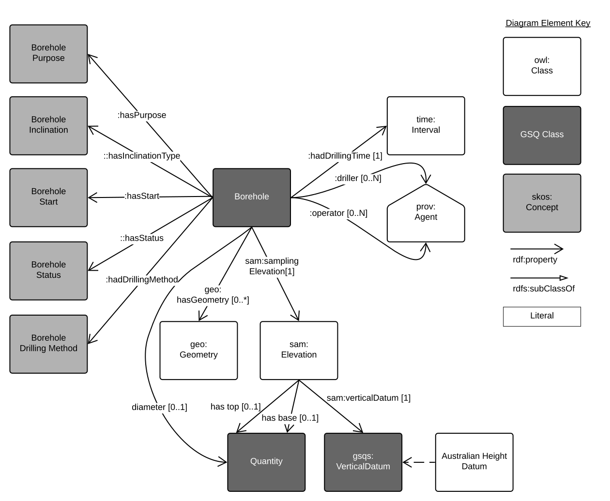
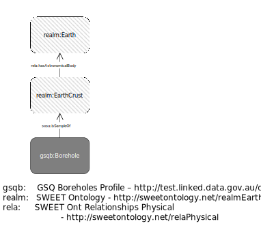
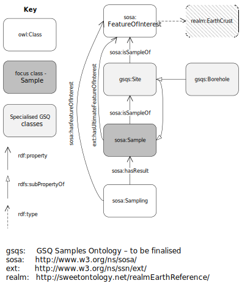

# GSQ Borehole Profile
This is a model of a geoscience *borehole*.

  

**Fig. 1**: Basic properties of the `Borehole` class object  

It is the [Geological Survey of Queensland (GSQ)](https://www.business.qld.gov.au/industries/mining-energy-water/resources/geoscience-information/gsq)'s' profile of multiple specifications for biophysical monitoring sites, observations & measurements, sampling and geospatial features. This means data recorded using it can be exported in accordance with a number of well-known international and national standards thus it should be maximally interoperable.

The specific specifications that this model profiles are:

* [GeoSciML](https://www.opengeospatial.org/standards/geosciml) - an [Open Geospatial Consortium](https://www.opengeospatial.org/) (OGC) standard for geoscience data representation that includes a borehole model
* [Observations & Measurements](https://www.iso.org/standard/32574.html) - an [International Organization for Standardisation](https://www.iso.org) (ISO) model for real-world observations, measurement and features of interest
* [Sensor, Observation, Sample, and Actuator (SOSA)](https://www.w3.org/TR/vocab-ssn/) - part of the [World Wide Web Consortium](https://www.w3.org/)'s Semantic Sensor Network ontology about sites, sampling, observations & sensors
* [GeoSPARQL](https://www.opengeospatial.org/standards/geosparql) - an OGC standard for representing real-world features and their geometries. Used for many spatial objects

This profile is designed to meet the needs of the [Geological Survey of Queensland]() (GSQ) and to both interoperate with other information models and profiles in use by them (such as the [GSQ Samples Profile](https://github.com/CSIRO-enviro-informatics/gsq-sample-profile) and the [GSQ Dataset Profile](https://github.com/CSIRO-enviro-informatics/gsq-dataset-profile)) and also with national (Australia) and international geoscience information models and systems.

### Other views of a `Borehole`

  

**Fig. 2**: Borehole as a GeoSPARQL `Feature`  

  

**Fig. 3**: Borehole in relation to SWEET ontology objects  

  

**Fig. 4**: Borehole in relation SOSA objects (for sample relations)  

## Profile Resources
This profile is presented as a series of files that perform different roles:

* [Guidance document](Guidance.pdf) - a written document explaining how to use this profile
* [model](model/) - the *model* folder contains the model specification itself. This is given as both images and also as a formal [RDF](https://www.w3.org/RDF/) model file (ontology).
* [profile.ttl](profile.ttl) - the profile declaration. A description of all of the items in this profile (the formal model, validating resources, documentation etc.) according to the W3C's [Profiles Ontology](https://www.w3.org/TR/dx-prof/) which describes how all the parts related to one another, the roles they play (to give *guidance* for use, to *validate* data etc.) and how this profile *profiles* the various standards listed above.
* [full-constraints.ttl](full-constraints.ttl) - a [SHACL](https://www.w3.org/TR/shacl/) constraints language *Shapes graph* used to validate instances of `Borehole`s expressed in RDF
* [ckan-schema.json](ckan-schema.json) - a form schema for the [CKAN dataset catalogue tool](https://ckan.org) to create a data entry form for `Borehole`s

## License
The content of this repository is licensed for use with the [Creative Commons 4.0 License](https://creativecommons.org/licenses/by/4.0/). See the [license deed](LICENSE) for details.

## Contacts
*owner*:  
**Geological Survey of Queensland**  
1 William St, Brisbane, Queensland, Australia  

*author*:  
**Nicholas Car**  
*Senior Experimental Scientist*  
CSIRO Land & Water, Environmental Informatics Group  
<nicholas.car@csiro.au>
